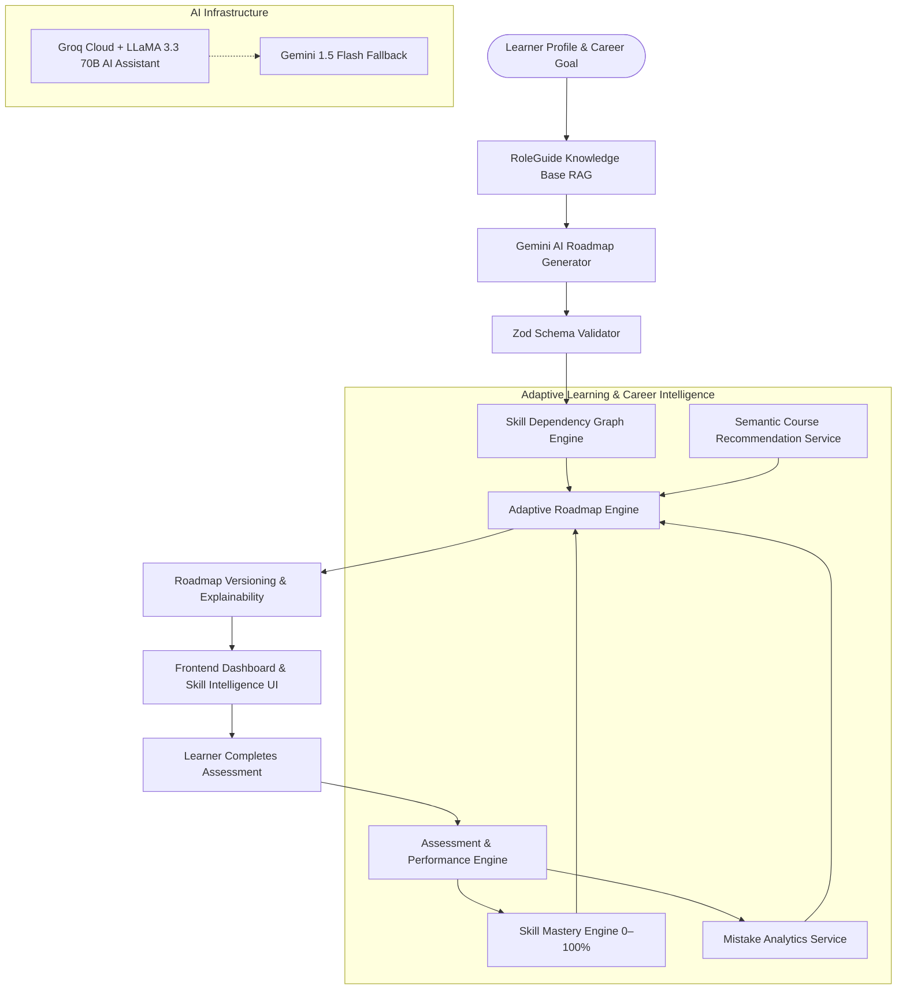

# The-Setu – Adaptive Learning & Career Intelligence Platform

[](https://the-setu-student-skill-progression.onrender.com)
[](https://opensource.org/licenses/MIT)
[](https://nodejs.org/)
[](https://reactjs.org/)
[](https://www.typescriptlang.org/)
[](https://groq.com/)
[](https://ai.google.dev/)

> **The-Setu** is an AI-powered Career Development and Adaptive Skill Progression Platform. It bridges academic learning with real-world industry requirements through deterministic skill mastery calculations, dynamic dependency graphs, automated technical assessments, mistake intelligence, and semantic course matching.

---

## 🏗️ System Architecture



---

## 🌟 The Five Connected Core Engines

### 1. 🎯 Skill Mastery Engine (`0–100%`)
Calculates a numerical mastery score for every skill based on a configurable, deterministic weighted model:
* **Assessment Performance (50%)**: Weighted performance across recent technical assessments.
* **Mistake Performance (25%)**: Real-time penalty for open errors and resilience bonus for resolved mistakes.
* **Completion & Progress (15%)**: Lesson and course completion metrics.
* **Practice Consistency (10%)**: Frequency and recency of practice sessions.

**Mastery Score Interpretation:**
* `0–39%` ➔ **Beginner** (Focus on core fundamentals)
* `40–69%` ➔ **Developing** (Intermediate practice & targeted quizzes)
* `70–84%` ➔ **Proficient** (Advanced scenarios & portfolio projects)
* `85–100%` ➔ **Mastered** (Competency verified; unlocks dependent advanced skills)

---

### 2. 🕸️ Skill Dependency Graph Engine (DAG)
Maintains directed dependency relationships across engineering, cybersecurity, AI/ML, and cloud domains:
* **Cycle Prevention**: DFS graph cycle detection ensures no circular prerequisites can occur.
* **Prerequisite Enforcement**: Skills with unmet prerequisites ($< 70\%$ mastery) are locked.
* **Automated Remediation**: Injects prerequisite remediation before allowing learners to jump into advanced topics.
* **Interactive Visualization**: Interactive visual dependency graph showing Mastered, Proficient, Developing, Weak, and Locked states.

---

### 3. 🧪 Assessment & Performance Engine
Interactive technical assessment system:
* **Dynamic Generation & Seed Bank**: Curated question banks for core skills + Google Gemini dynamic generation for niche skills with offline fallbacks.
* **Live Grading & Scoring**: Instant percentage scores, correct/incorrect review, and time-tracking.
* **Automatic Mistake Logging**: Incorrect answers automatically create/update open `Mistake` records with severity ratings and categorized error types.
* **Instant Mastery Recalculation**: Submissions immediately trigger `MasteryEngine` recalculation and live frontend dashboard updates.

---

### 4. 📚 Semantic Course Recommendation Engine
Hybrid recommendation engine matching courses to learner gaps:
* **Semantic Token & Synonym Matching**: Matches courses via domain synonyms (e.g. SIEM ➔ Wazuh, Splunk, Elastic) even when exact titles differ.
* **Multi-Factor Scoring**:
  $$\text{Score} = (\text{Relevance} \times 0.40) + (\text{Difficulty Match} \times 0.25) + (\text{Rating} \times 0.15) + (\text{Skill Gap Priority} \times 0.20)$$
* **Explainable Recommendations**: Every suggested resource provides a clear human-readable reason (e.g. *"Recommended because it targets SIEM, your highest-priority skill gap (42% mastery), matching your Beginner level."*).

---

### 5. 🔄 Adaptive Roadmap Engine with Versioning
The central intelligence brain integrating Profile, Goal, RoleGuide RAG, Skill Graph, Mastery, Mistakes, Assessments, and Course Recommendations:
* **Deterministic Rules**: Adapts phases dynamically without destroying past progress.
* **Explainable Next Best Action**: Highlights the single highest-priority next step (e.g. resolving repeated mistakes or taking an assessment).
* **Roadmap Versioning**: Tracks roadmap evolution (`v1` ➔ `v2` ➔ `v3`) with complete audit logs of adaptation triggers and timestamped reasons.

---

## 🤖 AI & RAG Infrastructure

| Feature | Primary AI Engine | Model | Purpose / Fallback |
| :--- | :--- | :--- | :--- |
| **AI Assistant Chat** | **Groq Cloud** | `llama-3.3-70b-versatile` | Ultra-fast career coaching; falls back to Gemini on error. |
| **Roadmap Generation** | **Google Gemini** | `gemini-flash-latest` | Generates structured JSON roadmaps verified by Zod schema. |
| **RoleGuide RAG** | **MongoDB Text Search** | `RoleGuide` Model | Ingests industry standard must-have skills into AI prompt. |
| **Dynamic Assessments** | **Google Gemini** | `gemini-flash-latest` | Dynamic 5-question technical quiz generation with offline fallbacks. |

> [!NOTE]
> The AI Assistant runs exclusively on **Groq + LLaMA 3.3 70B** for sub-second responses. (Outdated references to xAI Grok have been removed).

---

## 📡 API Reference

### 🎯 Skill & Mastery APIs
| Method | Endpoint | Description |
| :--- | :--- | :--- |
| `POST` | `/api/skills/analyze` | Generate or fetch roadmap with RAG & Gemini |
| `GET` | `/api/skills/latest` | Get user's latest roadmap with adaptive remediation |
| `GET` | `/api/skills/mastery` | Get user's skill mastery scores, levels, and summary |
| `GET` | `/api/skills/graph` | Get interactive skill graph nodes and dependency edges |
| `GET` | `/api/skills/gaps` | Get active skill gaps and weak skill priorities |
| `GET` | `/api/skills/recommendations` | Get semantic course recommendations for skills |
| `PATCH` | `/api/skills/:roadmapId/skills/:skillName` | Update skill status (pending, in-progress, completed, verified) |

### 🔄 Adaptive Intelligence APIs
| Method | Endpoint | Description |
| :--- | :--- | :--- |
| `GET` | `/api/adaptive/roadmap` | Get real-time adapted roadmap with version history |
| `GET` | `/api/adaptive/next-action` | Get highest-priority Next Best Action for the learner |
| `GET` | `/api/adaptive/insights` | Get dashboard mastery metrics, velocity, and distribution |

### 🧪 Assessment APIs
| Method | Endpoint | Description |
| :--- | :--- | :--- |
| `GET` | `/api/assessments/skill/:skillName` | Get or generate assessment for a skill (sanitized) |
| `POST` | `/api/assessments/:id/submit` | Submit answers, grade, log mistakes, and update mastery |
| `GET` | `/api/assessments/history` | Get user's past assessment attempt records |

### ⚠️ Mistake Analytics APIs
| Method | Endpoint | Description |
| :--- | :--- | :--- |
| `GET` | `/api/mistakes/analytics` | Batched mistake analytics, trends, and aggregations |
| `GET` | `/api/mistakes` | Get user's open and resolved mistake records |
| `POST` | `/api/mistakes` | Log a new mistake manually |
| `PUT` | `/api/mistakes/:id/resolve` | Mark a mistake as resolved |
| `PUT` | `/api/mistakes/:id/reopen` | Reopen a previously resolved mistake |

---

## 🛠️ Technology Stack

* **Frontend**: React 18.3, TypeScript 5.9, Vite 6.3, Tailwind CSS 4.1, Lucide Icons, Recharts, Radix UI.
* **Backend**: Node.js 18+, Express.js 4.18, MongoDB & Mongoose 9.1, JWT, bcryptjs, Zod 4.3.
* **AI & Cloud**: Groq Cloud SDK (`llama-3.3-70b-versatile`), Google Generative AI (`@google/generative-ai`), Adzuna Jobs API.
* **Testing**: Jest 30.4, Supertest 7.2, cross-env.

---

## 🚀 Installation & Local Development

### 1. Clone & Configure Environment

Create `.env` inside the `server/` directory:
```env
PORT=3000
MONGO_URI=mongodb+srv://<username>:<password>@cluster0.mongodb.net/careerpath
JWT_SECRET=your_jwt_secret_key_here
GEMINI_API_KEY=your_gemini_api_key_here
GROQ_API_KEY=your_groq_api_key_here
ADZUNA_APP_ID=your_adzuna_app_id
ADZUNA_APP_KEY=your_adzuna_app_key
```

### 2. Start Backend Server
```bash
cd server
npm install
npm run dev
```
Backend runs at `http://localhost:3000`.

### 3. Start Frontend Client
In the project root:
```bash
npm install
npm run dev
```
Frontend runs at `http://localhost:5173`.

### 4. Run Test Suites
```bash
cd server
npm test
```
Runs all 10 unit and integration test suites.

---

## 📄 License
This project is licensed under the MIT License - see the [LICENSE](LICENSE) file for details.
